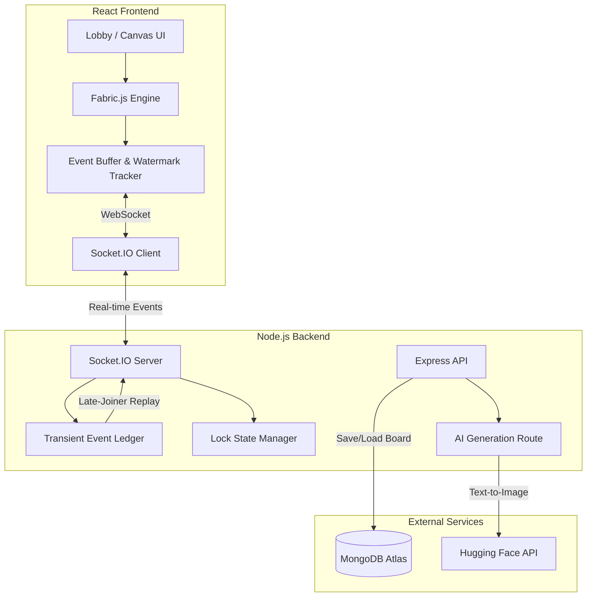

# Realtime-Canvas-AI

> A real-time collaborative whiteboard application with AI-driven image generation, built for seamless multi-user creative sessions.

[](https://nodejs.org/)
[](https://react.dev/)
[](https://socket.io/)
[](https://www.mongodb.com/)

---

## 📸 Demo

| Lobby | Canvas — Drawing | Canvas — AI Generation |
|-------|-----------------|----------------------|
|  |  |  |

> *Replace these placeholders with actual screenshots of the running application.*

---

## Overview

**Realtime-Canvas-AI** is a full-stack collaborative whiteboard that lets multiple users draw, place shapes, insert text, and generate AI images — all synchronized in real time across every connected client.

Under the hood, it tackles non-trivial distributed systems problems: out-of-order event reconciliation, asynchronous media hydration race conditions, and fine-grained object-level locking to prevent conflicting edits. Board state is persisted to MongoDB so sessions survive disconnects and reconnects without data loss.

---

## Features

- **Live Multi-User Sync** — Every stroke, shape, and modification propagates instantly to all participants via WebSocket channels.
- **Drawing Toolkit** — Freehand pen, geometric primitives (rectangle, circle, line), text input, and a precision eraser.
- **AI Image Generation** — Type a prompt, hit generate, and the Hugging Face Inference API produces an image directly on the canvas.
- **Object Locking** — When a user selects an object, it becomes locked with a visual overlay (reduced opacity + colored border), preventing other users from modifying it simultaneously.
- **Late-Joiner State Recovery** — A server-side transient event ledger replays missed operations for clients that join mid-session, bridging the gap between the last database snapshot and the live state.
- **Undo / Redo** — Full action history stack with socket-aware state rollback.
- **Persistent Rooms** — Create or join named rooms via a lobby interface; canvas state auto-saves to MongoDB.

---

## Tech Stack

| Layer | Technology |
|-------|-----------|
| **Frontend** | React 19, React Router v7, Fabric.js 5.3, Lucide Icons |
| **Backend** | Node.js, Express 5, Socket.IO |
| **Database** | MongoDB with Mongoose ODM |
| **AI** | Hugging Face Inference API (`@huggingface/inference`) |

---

## System Architecture



---

## Engineering Deep Dive

### Real-Time State Synchronization

The server operates as the central event router for all canvas operations. Rather than relying on periodic database polling, which introduces unacceptable latency for a drawing application, every mutation (draw, move, resize, delete) is broadcast through Socket.IO immediately.

However, database saves are expensive and batched. This creates a consistency gap: what happens to operations between saves? The solution is a **Transient Event Ledger** — an in-memory ring buffer on the server that records every operation chronologically. When a late-joining client connects, the server responds with the last MongoDB snapshot *plus* the full ledger of events since that snapshot, allowing the client to reconstruct the exact current board state by replaying events in order.

### Event Ordering with Sequence Watermarks

Network delivery is non-deterministic — events dispatched as `[A, B, C]` may arrive as `[C, A, B]`. Naively applying them out of order would corrupt the canvas (e.g., moving an object before it's created).

To solve this, the server assigns a strictly monotonic `eventId` to every operation. The client maintains a **contiguous-prefix sequence tracker**: it only applies events to the Fabric.js canvas when it can guarantee no gaps exist in the sequence. If event #7 arrives before #6, it sits in a local buffer. The moment #6 arrives, both #6 and #7 flush together in the correct order. This ensures mathematically provable event consistency without blocking the UI thread.

### Asynchronous Image Hydration

AI image generation introduces a unique race condition. When a user generates an image, the server broadcasts the creation event to all clients. Each client then calls `fabric.Image.fromURL()` to decode and render the Base64 payload — an inherently asynchronous operation that can take hundreds of milliseconds.

During this decode window, other events may arrive that reference the image (lock acquisitions, position updates, property changes). If these events fire against a not-yet-rendered image, they silently fail.

The fix involves deep event buffering: incoming lock and position events are intercepted and queued against the target object's UUID in dedicated ref buffers (`pendingImagePositionsRef`, `pendingLocksRef`). When the `fromURL` callback finally completes and the image object is constructed, the client immediately drains the buffer and applies all deferred state mutations *before* the next render frame. This eliminates ghost images, dropped locks, and visual desynchronization entirely.

### Concurrency Control via Object Locking

Collaborative editing requires a concurrency protocol. When a user selects a canvas object, the client emits an `acquire_lock` event. The server validates the request (ensuring no existing lock and no self-locking), registers the lock in memory, and broadcasts a visual lock notification to all other clients. Locked objects render with reduced opacity and a colored border, signaling they're being edited.

On disconnect, the server automatically releases all locks held by the departing client and broadcasts cleanup events, preventing orphaned "ghost locks" from persisting on the board.

---

## Getting Started

### Prerequisites

- Node.js v18+
- MongoDB instance (local or [Atlas](https://www.mongodb.com/atlas))
- Hugging Face API key ([get one here](https://huggingface.co/settings/tokens))

### Installation

```bash
# Clone the repository
git clone https://github.com/roopaky145-creator/CanvasSync-2nd-Project.git
cd CanvasSync-2nd-Project

# Install server dependencies
cd server
npm install

# Install client dependencies
cd ../client
npm install
```

### Environment Variables

**`server/.env`**
```env
PORT=3001
FRONTEND_URL=http://localhost:3000
MONGO_URI=your_mongodb_connection_string
AI_API_KEY=your_huggingface_api_key
```

**`client/.env`**
```env
REACT_APP_BACKEND_URL=http://localhost:3001
```

### Running Locally

```bash
# Terminal 1 — Start the backend
cd server
npm start

# Terminal 2 — Start the frontend
cd client
npm start
```

Open [http://localhost:3000](http://localhost:3000) in your browser. Open a second browser tab to test multi-user collaboration.

---

## Project Structure

```
├── client/
│   ├── public/               # Static assets
│   └── src/
│       ├── components/
│       │   ├── AIPromptPanel.jsx   # AI image generation UI
│       │   ├── AIPromptPanel.css
│       │   └── Toolbar.jsx         # Drawing tools toolbar
│       ├── pages/
│       │   ├── Canvas.jsx          # Main canvas page (core logic)
│       │   ├── Lobby.jsx           # Room creation/joining
│       │   └── Lobby.css
│       ├── App.js                  # Router configuration
│       └── index.js                # Entry point
├── server/
│   ├── models/
│   │   ├── Board.js                # Canvas state schema
│   │   └── Room.js                 # Room schema
│   ├── routes/
│   │   ├── ai.js                   # AI generation endpoint
│   │   ├── boardRoutes.js          # Board CRUD endpoints
│   │   └── rooms.js                # Room management
│   ├── socket/
│   │   └── roomHandlers.js         # Socket event handlers
│   └── index.js                    # Server entry point
```

---

## License

This project is open source and available under the [MIT License](LICENSE).
